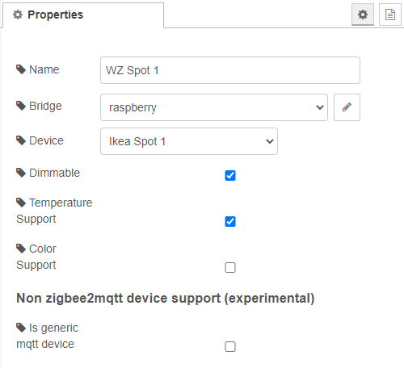
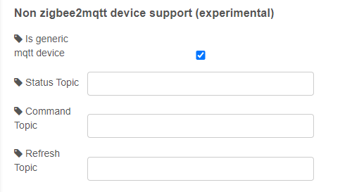

# Device configuration

## Bridge

For more information see [bridge-config](../config/bridge-config.md)

## Device

Select your device from the list. If nothing is shown here, you have probably just created a new bridge configuration and you need to deploy it first in order to get a result here. If not open a ticket and explain as detailed as possible what you have done :)

## Dimmable

Define here if your lamp supports a brightness change.

>If this is not checked the generic-lamp configuration view will hide the brightness field from you.

## Temperate support

Define here if your lamp supports color temperature. 

> If this is not checked the generic-lamp configuration view will hide the color temperature field from you.

## Color support

Define here if your lamp supports RGB colors.

> If this is not checked the generic-lamp configuration view will hide the RGB color fields from you.

## Experimental non z2m device support

It is planed to also support non-z2m devices that can be controlled by MQTT. It is highly experimental and does not have high priority right now. It will get more attention when the project is near version 1.0

For now it is only supported in the [generic-lamp](../nodes/generic-lamp.md) and [send-messages](../nodes/send-messages.md) nodes.

### Status topic

Devices should send there state change to this topic

> Can be conpared with *zigbee2mqtt/friendly_name*

### Command topic

When something is published to this topic, the device should change it state. It has to be able to parse the payload that is also be sent to zigbee2mqtt

> Can be conpared with *zigbee2mqtt/friendly_name/set*

### Refresh topic

When something is published to this topic, the device should respond with it's current state to the **status topic**. It has to be the same payload that zigbee2mqtt sends when a zigbee device changes it state.

> Can be conpared with *zigbee2mqtt/friendly_name/get*

[Back to main](../../README.MD)