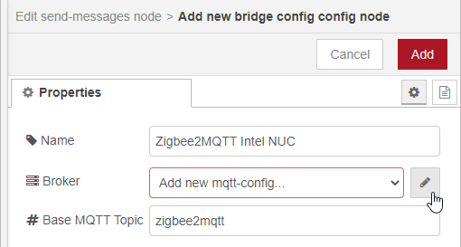
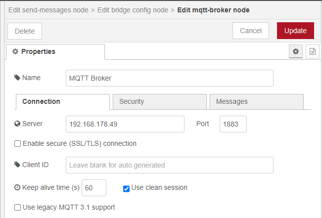
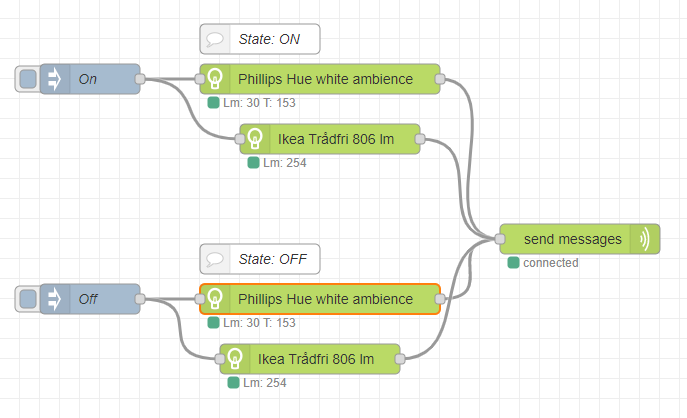
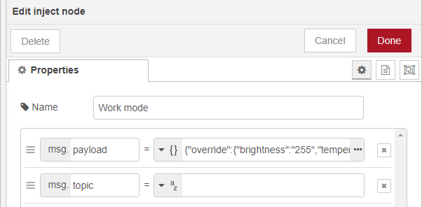

# Getting started guide

This getting started guide shows you how to exemplary create a simple Zigbee2MQTT and Node-RED setup.
And then how to use the "Zigbee2MQTT Nodes for Node-RED" to create a basic home automation system with a few devices.

// ToDo: Add graphic of the devices.
// ToDo: Add graphic of the final lamp installation.
// ToDo: change the readme.md text to reference this guide


# Exemplary Zigbee2MQTT and Node-RED setup

In this section, we will demonstrate a exemplary setup for [Zigbee2MQTT](https://www.zigbee2mqtt.io/), [Node-RED](https://nodered.org/docs/getting-started/) and [Mosquitto](https://mosquitto.org/man/mosquitto-8.html) using Docker.
For more detailed documentation on how to set up these components, we recommend the linked documentation.

> **Note**: If you already have a working Zigbee2MQTT, MQTT-Broker, and Node-RED installation, you can skip this section.


## Prerequisites
You have a Linux machine with Docker installed.
We tested this on:
- An Intel NUC running Ubuntu Server 20.04 LTS
- A Raspberry PI 2 and 4 running Raspian / Raspberry Pi OS.

And you have a supported Zigbee adapter for Zigbee2MQTT.
See [Zigbee2MQTT Docs: What do I need?](https://www.zigbee2mqtt.io/getting_started/what_do_i_need.html).
If you have a bit of money to spend, we suggest the [Texas Instruments LAUNCHXL-CC1352P-2 Zigbee adapter](https://www.zigbee2mqtt.io/information/supported_adapters.html#texas-instruments-launchxl-cc1352p-2) because the range is better and supports way more devices.


## Setup Process

1. **Verify that Docker and Docker Compose are installed.**
    ``` console
    andreas@nuc:~$ docker --version
    Docker version 19.03.13, build 4484c46d9d

    andreas@nuc:~$ docker-compose --version
    docker-compose version 1.27.4, build 40524192
    ```

2. **Plugin the Zigbee Adapter into your device.**
    
    It should appear as a device in `/dev`. Most of the time, the location is `/dev/ttyACM0`. See [Zigbee2MQTT docs](https://www.zigbee2mqtt.io/getting_started/running_zigbee2mqtt.html#1-determine-location-of-cc2531-usb-sniffer-and-checking-user-permissions). 

    To look for the adapter in `/dev` run:
    ``` console
    andreas@nuc:~$ ls -d /dev/*ACM*
    /dev/ttyACM0
    ```
    
    If it is any different from `/dev/ttyACM0`, you have to update the device in the `docker-compose.yml` file to grant Zigbee2MQTT access to the adapter. We will create the `docker-compose.yml` in the **next step** - remember it for now.
    ``` yml
    services:
      zigbee2mqtt:
        devices:
          - device=/dev/ttyACM0
    ```

3. **Configuring the Docker containers**

    In this step, we will create three Docker containers using Docker compose.
    For simplicity, we will map the volumes to a folder in the users home directory.

    We will create three containers.
    - Mosquitto MQTT Broker
    - Zigbee2MQTT (Connects to Mosquitto)
    - Node-RED (Connects to Mosquitto)

    For general understanding: Node-RED does not directly connect to Zigbee2MQTT. Only via the Mosquitto broker as a middleware.

    Let's create some directories first.
    ``` console
    andreas@nuc:~$ mkdir ~/smarthome
    andreas@nuc:~$ cd ~/smarthome/
    andreas@nuc:~/smarthome$ mkdir nodered
    andreas@nuc:~/smarthome$ mkdir mosquitto
    andreas@nuc:~/smarthome$ mkdir mosquitto/config
    ```

    Now create the docker-compose file with the editor of your choice.
    ``` console
    andreas@nuc:~/smarthome$ nano docker-compose.yml
    ```

    The compose file contains our three containers (Node-RED, Zigbee2MQTT, and Mosquitto).
    You can copy and paste this configuration. Remember to adjust the Zigbee adapter if you are using a different adapter than `/dev/ttyACM0`.

    ``` yml
    version: "3.8"

    services:
      zigbee2mqtt:
        image: koenkk/zigbee2mqtt:latest
        container_name: z2m_composed
        volumes:
          - /run/udev:/run/udev:ro
          - ${PWD}/z2m:/app/data
        ports:
            - "8080:8080"
        environment:
          - TZ=Europe/Berlin
        devices:
          - device=/dev/ttyACM0
        network_mode: "host"
        restart: always
        privileged: true
        depends_on:
          - mosquitto

      mosquitto:
          image: eclipse-mosquitto
          container_name: mosquitto_composed
          volumes:
            - ${PWD}/mosquitto:/mosquitto
          ports:
            - "1883:1883"
            - "9001:9001"
          restart: always

      nodered:
          image: nodered/node-red
          container_name: nodered_composed
          volumes:
            - ${PWD}/nodered:/data
          ports:
            - "1880:1880"
          restart: always
          depends_on:
            - zigbee2mqtt
            - mosquitto
    ```

    Before we run our containers, we also have to configure Mosquitto.
    Create the following config using your favorite editor:

    ``` console
    andreas@nuc:~/smarthome$ nano mosquitto/config/mosquitto.conf
    ```

    Paste this configuration to define the logging and persistence locations.

    ```
    persistence true
    persistence_location /mosquitto/data/
    log_dest file /mosquitto/log/mosquitto.log
    ```

4. **Create and run the Docker containers**

    Now we can run our containers for the first time. Docker will pull all the images, and the containers will create their default configurations and initialize.

    ``` console
    andreas@nuc:~/smarthome$ docker-compose up
    ```

    Have a look at the output. If you can't see any errors, you should be good to go.
    After the containers are initialized, press <kbd>ctrl</kbd> + <kbd>c</kbd> to stop the containers.

5. **Configure PAN ID and Zigbee channel**

    After your containers have been stopped, open the Zigbee2MQTT configuration.

    ``` console
    andreas@nuc:~/smarthome$ sudo nano z2m/configuration.yaml
    ```

    It should look like this:

    ``` yml
    # Home Assistant integration (MQTT discovery)
    homeassistant: false

    # allow new devices to join
    permit_join: true

    # MQTT settings
    mqtt:
      # MQTT base topic for zigbee2mqtt MQTT messages
      base_topic: zigbee2mqtt
      # MQTT server URL
      server: 'mqtt://localhost'
      # MQTT server authentication, uncomment if required:
      # user: my_user
      # password: my_password

    # Serial settings
    serial:
      # Location of CC2531 USB sniffer
      port: /dev/ttyACM0
    ```

    At the end of the configuration, we add the advanced section. It defines a custom PAN ID and a channel. This is a best practice because, if a neighbor suddenly uses the same default PAN ID, re-pairing all the devices would be necessary.
    For more settings, check out the [Zigbee2MQTT configuration docs](https://www.zigbee2mqtt.io/information/configuration.html).
    Also enable the [frontend](https://www.zigbee2mqtt.io/information/frontend.html) and the experimental API, so we can see rename our devices.

    ``` yml
    advanced:
      # Optional: ZigBee pan ID
      pan_id: 815
      # Optional: ZigBee channel, changing requires re-pairing of all devices.
      # (Note: use a ZLL channel: 11, 15, 20, or 25 to avoid Problems)
      # (default: 11)
      channel: 15
    frontend:
      port: 8080
    experimental:
      new_api: true
    ```

6. **Run your containers in the background**

    You now configured all the basic settings. You are now ready to run the containers in the background. To do so, supply the `--detach` switch to the docker-compose command. See [Docker docs](https://docs.docker.com/compose/reference/up/).

    ``` console
    andreas@nuc:~/smarthome$ docker-compose up --detach
    ```

    If you want to stop the detached containers later to change the settings, you can run `docker-compose down`.


7. **Check everything is running** 

    Open `http://ip-of-your-device:8080/` in your browser, to view the Zigbee2MQTT frontend.

    Open `http://ip-of-your-device:1880/` in your browser.
    If an empty Node-RED dashboard loads, I'd like to congratulate you - you finished the Node-RED setup.

8. **Install the Zigbee2MQTT Nodes for Node-RED**

    Open the the Palettte: `Menu` > `Manage palette` > `Install tab`

    Search for `node-red-contrib-zigbee2mqtt-devices` and install it.

    


## After setup considerations

This setup is very basic. We suggest a few things that should be done but would be too much for this tutorial's scope. Have a look at the [Zigbee2MQTT](https://www.zigbee2mqtt.io/), [Node-RED](https://nodered.org/docs/getting-started/) and [Mosquitto](https://mosquitto.org/man/mosquitto-8.html) documentation on how to configure them.


**Authentication**

Right now, Mosquitto and the Node-RED interface do not use any authentication. We advise you to set up authentication.

**Secure connection**
With the default configuration, the MQTT connection and the HTTP connection to the Node-RED web interface are not encrypted. Mosquitto can be configured with TLS and Node-RED with HTTPS.

**Disable paring mode**
Currently, Zigbee2MQTT is configured to [let new devices join](https://www.zigbee2mqtt.io/getting_started/pairing_devices.html).
After you have added all your devices and are done with the initial setup, you should disable this by setting `permit_join: false` in the `z2m/configuration.yaml`.


# Pairing our devices with Zigbee2MQTT
Now it's time to [pair](https://www.zigbee2mqtt.io/getting_started/pairing_devices.html) some devices.

For my demonstration I use the following devices and pair them.
- [IKEA Trådfri ON/OFF switch (E1743)](https://www.zigbee2mqtt.io/devices/E1743.html)

    

- [Philips Hue white ambiance E27 bulb (9290022169)](https://www.zigbee2mqtt.io/devices/9290022169.html)

    

- [TRADFRI LED bulb, dimmable, warm white (LED1836G9)](https://www.zigbee2mqtt.io/devices/LED1836G9.html)

    

 Each device is a bit different to pair, so check the [Zigbee2MQTT Supported Devices docs](https://www.zigbee2mqtt.io/information/supported_devices.html) or your manurfacturers documentation on how to pair or reset devices. The switch for example requires me to press the pair button 4 times, the (brand new) bulb I just have to plugin.

After you paired your devices you should see them in the Zigbee2MQTT frontend.
For better distinction between the devices is advisable to rename your devices.


# Define your first flow

Now that we get everything setup, we can start to define our first flow. Lets start to switch the lamp from software first.

------------------------
//Todo: General Idea is always Modify your message in the payload. Then send the changes via send messages.
One way is to use the generic node to "hardcoded" set some settings.
Another to use the override settings.
Future - swicht sends modify flow messages.

Delay, for is the order important.

Concept is as follows: Modify the payload. Send message node does the work

------------------------

1. **Pull the send messages node into the flow.**
    
    Since this is our first node, we have have to configure how to connect to the Zigbee2MQTT bridge first. Click on the little edit icon to define a new bridge.

    

    To define the bridge we enter a name, levae the default MQTT topic and continue to configure a broker via the edit icon.

    

    We then can configure the Mosquitto server as our broker. I had to use the device IP and not localhost to get it working. Since authentication is not configured, I left it blank.

    
    
    **Important**: Before we continue, we have to **deploy** the flow once so the configured Zigbee2MQTT bridge is available to all the nodes. If everything worked out, we should see a little green connected indicator.

    

2. **Add the generic lamp node**

    Add the *generic lamp* node, connect it's output to the *send messages* node.
    Next, define a new *device config* for your lamp via the little edit icon.
    
    

    Give the light a name, select a Zigbee2MQTT device you paired and define it's capabilities.
    In our case it is dimmable, can change the color temperature but has no RGB color support.

    

    Back in the *generic-lamp* config we can define to set the brightness to 30 (range from 0 to 255).
    And the color to 153 (around 6500° Kelvin). The color uses the Mirek scale, with values usually between 50 and 400.
    
    `Mirek = 1.000.000 / Temp. in Kelvin`

    More on that in [Zigbee2MQTT Set topic](https://www.zigbee2mqtt.io/information/mqtt_topics_and_message_structure.html#zigbee2mqttfriendly_nameset) or on [Wikipedia Mired](https://en.wikipedia.org/wiki/Mired).

    

3. **Inject a message to trigger the lamp change**

    Drag a *inject* node into your flow and connect it to the lamp node (no special setting needed). Now you can deploy the changes.

    If you now click on the button next to the inject node, you should see your light turn darker and to cold white!

    


    **So how does this work?**

    The Z2M nodes always append the information that shall be sent to the current message of the flow.
    The *send messages node* then interprets the changes to be made, and publishes them via MQTT.
    In this case we only have one lamp and we defined the values directly within the *generic lamp node*.

    After the *inject node* you start with just a random message object. For our usecase this does not really matter.
    ``` json
    {
      "_msgid":"b0db48e0.9cf638",
      "payload":1606336827099,
      "topic":""
    }
    ```

    After the *generic lamp node* the message object now contains one device in the payload, with he settings specified.
    ``` json
    {
        "_msgid":"b0db48e0.9cf638",
        "payload":{
            "devices":[
                {
                    "topic":"Phillips Hue white ambience",
                    "state":"ON",
                    "delay":0,
                    "target":"z2m",
                    "brightness":"30",
                    "transition":"2",
                    "temperature":"153"
                }
            ]
        },
        "topic":""
    }
    ```

    As mentioned, the send message interpretes that payload and generates and sends the MQTT messages.

    At this point, you are probably asking yourself: Why this has to be so complicated. Why can the generic lamp node not directley send the message to Zigbee2MQTT?

    The thing is, usually we don't only wan't to switch one lamp - we wan't to switch multiple lamps.
    With the current implementation we would add one *generic lamp* to turn our lamp on and one *generic lamp* to turn it off. This can quickley escalate.
    Because of this reason we will later introduce *override nodes*. Override nodes allow you to set values for multiple devices. We will come back to that later, after we added a few more devices.

    > **For now you shall note, that the *generic lamp node* does two things:**
    > 1. Adds the lamp as a device to the payload so it will be triggered by send messages.
    > 2. Adjusts values for this individual devices.
 

4. **Toggle the Lamp**

    For now we got a lamp that we can turn on. Let's continue, by also let us turn the lamp off.
    The simpelest form to do that is just to tell the lamp to Toggle. If we send a Toggle command to the lamp, the lamp itself decides to turn on or off based on it's current state. The toggle is not implemented in Software in Zigbee2MQTT, but rather by the Lamp itself. So it can vary from lamp to lamp. The Phillips HUE Bulb for example always switches between 0% and the brightness that was last configured. It does not consider the set brightness in that case.

    To get the lamp to toggle, we open *generic lamp node* config and change the state form on to toggle and **deploy** the changes.
    
    
    
    If we now click the inject button multiple times, the lamp should turn off and on again. You can also see that the lamp indicator now turns off an on again.

    


5. **On / Off**

    Toggeling can be fine if you use a button. But if you use a switch, than you usually want to turn them off with dedicated buttons.

    So lets add another *inject node* and rename the two inject nodes *On* and *Off*. They will represent our switch.

     

    Then change the state of the *generic lamp node* to **ON**.

    

    We are now back where we started, and the lamp only turns on.
    Let's now duplicate the *generic lamp node* wire it to the *off inject node* and the *send messages node*

     

    Then we configure the second *generic lamp node* state to **OFF**

    

    If we deploy the changes, we can turn the lamp on and off.

    


6. **More lamps**
    Let's add another lamp and first illustrate how we would implement the lamp with the knowlege from the previeous step. Add a new *generic lamp node* and define a new device config in the lamp. In my case I configured a Ikea Trådfri blub that is warm white but dimmable. Set the State to On and the brightness to 255.
    Connect it to the *on inject node* and the *send message node*. Then duplicate the *generic lamp node* and just change the state to Off and connect it to the *off inject node* and to the *send messages node*.

    Now the two lamps are wired up in parallel and can switched on/off with the same inject node.

    

    If you have a lot of lamps, this can get a bit messy. Let's clean that up a bit by connecting the lamps in series.

    


    Message object after the first generic lamp.
    ``` json
    {
        "_msgid":"b0db48e0.9cf638",
        "payload":{
            "devices":[
                {
                    "topic":"Phillips Hue white ambience",
                    "state":"ON",
                    "delay":0,
                    "target":"z2m",
                    "brightness":"30",
                    "transition":"2",
                    "temperature":"153"
                }
            ]
        },
        "topic":""
    }
    ```

    Message object after the second generic lamp.

    ``` json
    {
        "_msgid": "b0db48e0.9cf638",
        "payload": {
            "devices": [
                {
                    "topic": "Phillips Hue white ambience",
                    "state": "ON",
                    "delay": 0,
                    "target": "z2m",
                    "brightness": "30",
                    "transition": "2",
                    "temperature": "153"
                },
                {
                    "topic": "Ikea Trådfri 806lm",
                    "state": "ON",
                    "delay": 0,
                    "target": "z2m",
                    "brightness": "254",
                    "transition": "2"
                }
            ]
        },
        "topic": ""
    }
    ```

    As you can see, the two devices are now in the same payload. The send messages will take both devices and send individual messages to Z2M via MQTT.

7. **Override nodes**

    Configuring the settings in the single lamp node is simple and easy
    if you have one lamp or want to set specific settings per lamp.
    If you want to controll values for a group of lamps instead, we created override nodes.
    Override nodes set (override) the values for all the lamps in the message.
    So if you want to sitch a group of devices, you can apply to all the lamps in the message.
    
    Lets remove the duplicate `generic-lamp` nodes that where connected to the off switch. And add two `override-state` nodes to after the *On* and *Off* switches. Configure the `override-state` nodes by setting one to on and the other to off.

    

    
    What happens behind the scenes is, that the message payload, now contains an override section and the two lamps. The `send messages` node gets this message object and interprets it. From the message, it knows it has tow devices to trigger, and it uses the values from the override section and applys them to all the devices. Meaning it overwrites the state of both devices and sets it to `OFF` before sending it.

    ``` json
    {
        "_msgid": "bcc6e6d9.13e8a8",
        "payload": {
            "override": {
                "state": "OFF"
            },
            "devices": [
                {
                    "topic": "Phillips Hue white ambience",
                    "state": "ON",
                    "delay": 0,
                    "target": "z2m",
                    "brightness": "30",
                    "transition": "2",
                    "temperature": "153"
                },
                {
                    "topic": "Ikea Trådfri 806lm",
                    "state": "ON",
                    "delay": 0,
                    "target": "z2m",
                    "brightness": "254",
                    "transition": "2"
                }
            ]
        },
        "topic": ""
    }
    ```

    This also gives us the posibility to add multiple overrides at once. E.g. for color or brightness.
    Lets create a relaxed mode where we dimm the brightness with an `override-brightness` node (set to 127) and set the color to warm white with the `override-temperature` node (set to 333).
    
    

    The three override values are applied to both devices, but only in case the *relax mode* inject node was pressed. Normal *On* and *Off* uses the default color and temperature set in the `generic-lamp` nodes.

    ``` json
    {
        "_msgid": "c287cb65.64eed8",
        "payload": {
            "override": {
                "brightness": "127",
                "temperature": 333,
                "state": "ON"
            },
            "devices": [
                {
                    "topic": "Phillips Hue white ambience",
                    "state": "ON",
                    "delay": 0,
                    "target": "z2m",
                    "brightness": "30",
                    "transition": "2",
                    "temperature": "153"
                },
                {
                    "topic": "Ikea Trådfri 806lm",
                    "state": "ON",
                    "delay": 0,
                    "target": "z2m",
                    "brightness": "254",
                    "transition": "2"
                }
            ]
        },
        "topic": ""
    }
    ```

    Overrides are a powerful tool, and probably the most useful when they are connected to remotes and switches.
    In general we advise you to more work with override nodes than setting the values itself. In combination with a switch it could look a bit like in this configuration.

    
    

    

8. **Set override JSON manually**

    Since the override nodes simply add json to the payload, we can make use of that to create some debug buttons.
    Let's add a new `inject` node called work mode and set the payload to this json.
    ``` json
    {"override":{"brightness":"255","temperature":100,"state":"ON"}}
    ```
    
    

    If we now connect the *work mode* node to the `gneric lamp` nodes, we can see the override working similar as in the relax mode.

    

    ``` json
    {
        "_msgid": "897c244.c1d08d8",
        "payload": {
            "override": {
                "brightness": "255",
                "temperature": 100,
                "state": "ON"
            },
            "devices": [
                {
                    "topic": "Phillips Hue white ambience",
                    "state": "ON",
                    "delay": 0,
                    "target": "z2m",
                    "brightness": "30",
                    "transition": "2",
                    "temperature": "153"
                },
                {
                    "topic": "Ikea Trådfri 806lm",
                    "state": "ON",
                    "delay": 0,
                    "target": "z2m",
                    "brightness": "254",
                    "transition": "2"
                }
            ]
        },
        "topic": ""
    }
    ```

9. **Where to go from here**
    Replace the inject nodes with a switch, add some colored lamps. Be creative 😊.
