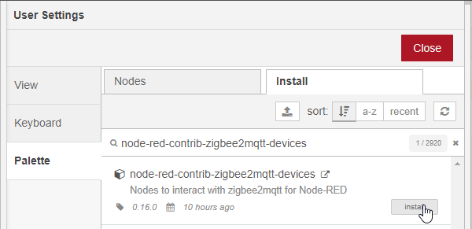
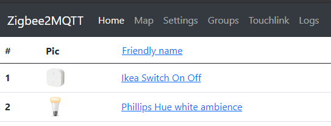
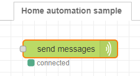

# Getting started guide

This getting started guide shows you how to exemplary create a simple Zigbee2MQTT and Node-RED setup. And then how to use the "Zigbee2MQTT Nodes for Node-RED" to create a basic home automation system with a few devices.

// ToDo: Add graphic of the devices.
// ToDo: Add graphic of the final lamp installation.

// Todo: test setup on raspberry pi 2
// Todo: test setup on raspberry pi 3


# Exemplary Zigbee2MQTT and Node-RED setup

In this section, we will demonstrate a exemplary setup for [Zigbee2MQTT](https://www.zigbee2mqtt.io/), [Node-RED](https://nodered.org/docs/getting-started/) and [Mosquitto](https://mosquitto.org/man/mosquitto-8.html) using Docker. For more detailed documentation on how to set up these components, we recommend the linked documentation.

> **Note**: If you already have a working Zigbee2MQTT, MQTT-Broker, and Node-RED installation, you can skip this section.


## Prerequisites
You have a Linux machine with Docker installed.
We tested this on:
- An Intel NUC running Ubuntu Server 20.04 LTS
- A Raspberry PI 2 and 4 running Raspian / Raspberry Pi OS.

And you have a supported Zigbee adapter for Zigbee2MQTT.
See [Zigbee2MQTT Docs: What do I need?](https://www.zigbee2mqtt.io/getting_started/what_do_i_need.html). If you have a bit of money to spend, we suggest the [Texas Instruments LAUNCHXL-CC1352P-2 Zigbee adapter](https://www.zigbee2mqtt.io/information/supported_adapters.html#texas-instruments-launchxl-cc1352p-2) because the range is better and supports way more devices.


## Setup Process

1. **Verify that Docker and Docker Compose are installed.**
    ``` console
    andreas@nuc:~$ docker --version
    Docker version 19.03.13, build 4484c46d9d

    andreas@nuc:~$ docker-compose --version
    docker-compose version 1.27.4, build 40524192
    ```

2. **Plugin the Zigbee Adapter into your device.**
    
    It should appear as a device in `/dev`. Most of the time, the location is `/dev/ttyACM0`. See [Zigbee2MQTT docs](https://www.zigbee2mqtt.io/getting_started/running_zigbee2mqtt.html#1-determine-location-of-cc2531-usb-sniffer-and-checking-user-permissions).

    You can find the adapter in `/dev`
    ``` console
    andreas@nuc:~$ ls -d /dev/*ACM*
    /dev/ttyACM0
    ```
    
    If it is any different from `/dev/ttyACM0`, you have to update the device in the `docker-compose.yml` file to grant Zigbee2MQTT access to the adapter. We will create the `docker-compose.yml` in the **next step** - remember it for now.
    ``` yml
    services:
      zigbee2mqtt:
        devices:
          - device=/dev/ttyACM0
    ```

3. **Configuring the Docker containers**

    In this step, we will create three Docker containers using Docker compose.
    For simplicity, we will map the volumes to a folder in the users home directory.

    We will create three containers.
    - Mosquitto MQTT Broker
    - Zigbee2MQTT (Connects to Mosquitto)
    - Node-RED (Connects to Mosquitto)

    For general understanding: Node-RED does not directly connect to Zigbee2MQTT. Only via the Mosquitto broker as a middleware.

    Let's create some directories first.
    ``` console
    andreas@nuc:~$ mkdir ~/smarthome
    andreas@nuc:~$ cd ~/smarthome/
    andreas@nuc:~/smarthome$ mkdir nodered
    andreas@nuc:~/smarthome$ mkdir mosquitto
    andreas@nuc:~/smarthome$ mkdir mosquitto/config
    ```

    Now create the docker-compose file with the editor of your choice.
    ``` console
    andreas@nuc:~/smarthome$ nano docker-compose.yml
    ```

    The compose file contains our three containers (Node-RED, Zigbee2MQTT, and Mosquitto).
    You can copy and paste this configuration. Remember to adjust the Zigbee adapter if you are using a different adapter than `/dev/ttyACM0`.

    ``` yml
    version: "3.8"

    services:
      zigbee2mqtt:
        image: koenkk/zigbee2mqtt:latest
        container_name: z2m_composed
        volumes:
          - /run/udev:/run/udev:ro
          - ${PWD}/z2m:/app/data
        ports:
            - "8080:8080"
        environment:
          - TZ=Europe/Berlin
        devices:
          - device=/dev/ttyACM0
        network_mode: "host"
        restart: always
        privileged: true
        depends_on:
          - mosquitto

      mosquitto:
          image: eclipse-mosquitto
          container_name: mosquitto_composed
          volumes:
            - ${PWD}/mosquitto:/mosquitto
          ports:
            - "1883:1883"
            - "9001:9001"
          restart: always

      nodered:
          image: nodered/node-red
          container_name: nodered_composed
          volumes:
            - ${PWD}/nodered:/data
          ports:
            - "1880:1880"
          restart: always
          depends_on:
            - zigbee2mqtt
            - mosquitto
    ```

    Before we run our containers, we also have to configure Mosquitto.
    Create the following config using your favorite editor:

    ``` console
    andreas@nuc:~/smarthome$ nano mosquitto/config/mosquitto.conf
    ```

    Paste this configuration to define the logging and persistence locations.

    ```
    persistence true
    persistence_location /mosquitto/data/
    log_dest file /mosquitto/log/mosquitto.log
    ```

4. **Create and run the Docker containers**

    Now we can run our containers for the first time. Docker will pull all the images, and the containers will create their default configurations and initialize.

    ``` console
    andreas@nuc:~/smarthome$ docker-compose up
    ```

    Have a look at the output. If you can't see any errors, you should be good to go.
    After the containers are initialized, press <kbd>ctrl</kbd> + <kbd>c</kbd> to stop the containers.

5. **Configure PAN ID and Zigbee channel**

    After your containers have been stopped, open the Zigbee2MQTT configuration.

    ``` console
    andreas@nuc:~/smarthome$ sudo nano z2m/configuration.yaml
    ```

    It should look like this:

    ``` yml
    # Home Assistant integration (MQTT discovery)
    homeassistant: false

    # allow new devices to join
    permit_join: true

    # MQTT settings
    mqtt:
      # MQTT base topic for zigbee2mqtt MQTT messages
      base_topic: zigbee2mqtt
      # MQTT server URL
      server: 'mqtt://localhost'
      # MQTT server authentication, uncomment if required:
      # user: my_user
      # password: my_password

    # Serial settings
    serial:
      # Location of CC2531 USB sniffer
      port: /dev/ttyACM0
    ```

    At the end of the configuration, we add the advanced section. It defines a custom PAN ID and a channel. This is a best practice because, if a neighbor suddenly uses the same default PAN ID, re-pairing all the devices would be necessary.
    For more settings, check out the [Zigbee2MQTT configuration docs](https://www.zigbee2mqtt.io/information/configuration.html).
    Also enable the [frontend](https://www.zigbee2mqtt.io/information/frontend.html) and the experimental API, so we can see rename our devices.

    ``` yml
    advanced:
      # Optional: ZigBee pan ID
      pan_id: 815
      # Optional: ZigBee channel, changing requires re-pairing of all devices.
      # (Note: use a ZLL channel: 11, 15, 20, or 25 to avoid Problems)
      # (default: 11)
      channel: 15
    frontend:
      port: 8080
    experimental:
      new_api: true
    ```

6. **Run your containers in the background**

    You now configured all the basic settings. You are now ready to run the containers in the background. To do so, supply the `--detach` switch to the docker-compose command. See [Docker docs](https://docs.docker.com/compose/reference/up/).

    ``` console
    andreas@nuc:~/smarthome$ docker-compose up --detach
    ```

    If you want to stop the detached containers later to change the settings, you can run `docker-compose down`.


7. **Check everything is running** 

    Open `http://ip-of-your-device:8080/` in your browser, to view the Zigbee2MQTT frontend.

    Open `http://ip-of-your-device:1880/` in your browser.
    If an empty Node-RED dashboard loads, I'd like to congratulate you - you finished the Node-RED setup.

8. **Install the Zigbee2MQTT Nodes for Node-RED**

    1. The the Palettte: `Menu` > `Manage palette` > `Install tab`

    2. Search for `node-red-contrib-zigbee2mqtt-devices` and install it.

    


## After setup considerations

This setup is very basic. We suggest a few things that should be done but would be too much for this tutorial's scope. Have a look at the [Zigbee2MQTT](https://www.zigbee2mqtt.io/), [Node-RED](https://nodered.org/docs/getting-started/) and [Mosquitto](https://mosquitto.org/man/mosquitto-8.html) documentation on how to configure them.


**Authentication**

Right now, Mosquitto and the Node-RED interface do not use any authentication. We advise you to set up authentication.

**Secure connection**
With the default configuration, the MQTT connection and the HTTP connection to the Node-RED web interface are not encrypted. Mosquitto can be configured with TLS and Node-RED with HTTPS.

**Disable paring mode**
Currently, Zigbee2MQTT is configured to [let new devices join](https://www.zigbee2mqtt.io/getting_started/pairing_devices.html).
After you have added all your devices and are done with the initial setup, you should disable this by setting `permit_join: false` in the `z2m/configuration.yaml`.


# Pairing our devices with Zigbee2MQTT
Now it's time to [pair](https://www.zigbee2mqtt.io/getting_started/pairing_devices.html) some devices.

For my demonstration I use the following devices and pair them.
- [IKEA Trådfri ON/OFF switch (E1743)](https://www.zigbee2mqtt.io/devices/E1743.html)

    

- [Philips Hue white ambiance E27 bulb (9290022169)](https://www.zigbee2mqtt.io/devices/E1743.html)

    

 Each device is a bit different to pair, so check the [Zigbee2MQTT Supported Devices docs](https://www.zigbee2mqtt.io/information/supported_devices.html) or your manurfacturers documentation on how to pair or reset devices. The switch for example requires me to press the pair button 4 times, the (brand new) bulb I just have to plugin.

After you paired your devices you should see them in the Zigbee2MQTT frontend.
For better distinction between the devices is advisable to rename your devices.




# Define your first flow

Now that we get everything setup, we can start to define our first flow. Lets start to switch the lamp from software first.

------------------------
//Todo: General Idea is always Modify your message in the payload. Then send the changes via send messages.
One way is to use the generic node to "hardcoded" set some settings.
Another to use the override settings.
Future - swicht sends modify flow messages.

Delay, for is the order important.

Concept is as follows: Modify the payload. Send message node does the work

------------------------

1. **Pull the send messages node into the flow.**
    
    Since this is our first node, we have have to configure how to connect to the Zigbee2MQTT bridge first. Click on the little edit icon to define a new bridge.

    

    To define the bridge we enter a name, levae the default MQTT topic and continue to configure a broker via the edit icon.

    

    We then can configure the Mosquitto server as our broker. I had to use the device IP and not localhost to get it working. Since authentication is not configured, I left it blank.

    
    
    **Important**: Before we continue we have to **deploy** the flow once, so the configured Zigbee2MQTT bridge is available to all the nodes. If everything worked out, we should see a little connected indicator.

    
