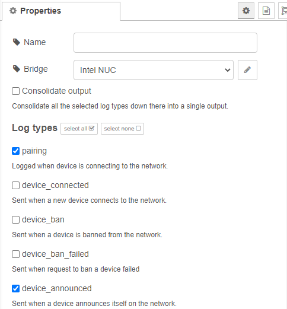
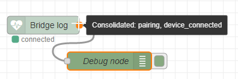

# Bridge log

The bridge log node provides an easy way to filter logs that are published into the 
`zigbee2mqtt/bridge/log` topic. You configure the types you are interested in, and the node creates one output for each type. This can be helpful if you only want to see specific logs (with the debug node) or perform actions based on the logs.

In this example, only the log types `pairing` and `device_announced` are selected. The `pairing` logs trigger a web request, the `device_announced` logs are sent to the debug node.


## Configuration

In the configuration, you select the log types you want to have an output created.
The following configuration creates the node in the example above with two outputs.



The bridge log node supports all 28 types. For more details about the types, look at the description in the configuration window or the [Zigbee2MQTT MQTT Topics and Message structure documentation](https://www.zigbee2mqtt.io/information/mqtt_topics_and_message_structure.html#zigbee2mqttbridgelog).

### Bridge

The Zigbee2MQTT bridge. For more information see [bridge-config](../config/bridge-config.md).

### Consolidated output

The consolidate output option is attractive if you want all or certain log types, but every log message results in the same action. If the consolidate output option is selected, all the selected log types will be sent over a single output.

The following example sends the logs with the type `pairing` or `device_connected` into the debug node.





## Message format

Zigbee2MQTT sends the logs to the `zigbee2mqtt/bridge/log` topic in the following format:
``` json
{ "type": "TYPE", "message": "MESSAGE" }
```
The bridge log node unwraps the message in the `message` property and put's it directly into the `payload`. The type is put into `action.name`. The payload is not necessarily a string - e.g., the `devices` log contains a list of devices.


### Example
The following MQTT message from Zigbee2MQTT:

``` json
{
    "type": "device_announced",
    "message": "announce"
}
```

Is converted into this Node-RED message object as it leaves the bridge log node.
``` json
{
    "action": {
        "name": "device_announced",
        "description": "Logs with the type: device_announced"
    },
    "payload": "announce",
    "_msgid": "770eadcb.231f54"
}
```