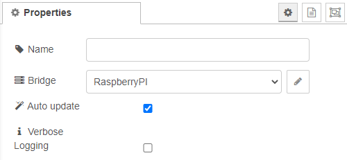
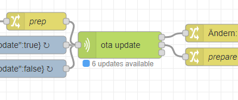
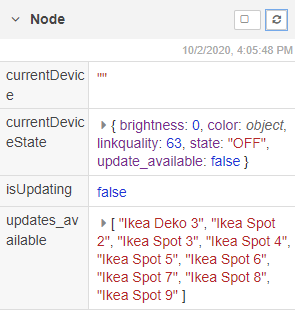
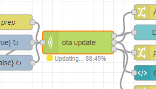
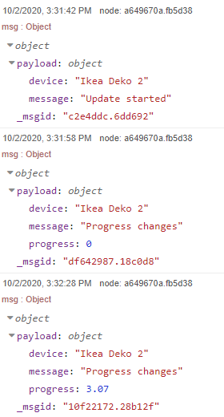
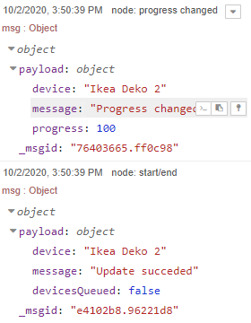

# OTA node

For basic information about OTA updates via zigbee2mqtt have a look at there documentation [here](https://www.zigbee2mqtt.io/information/ota_updates.html).

> if you use our dashboard, have a look at the end of the flow. the node is used there to auto update over night.

The ota-node is used to start OTA updates. This can be done manually or automatically. 

## Outputs

This node has 3 output. **start/end**, **progress** and **queue changed**. The name of the output matches with the trigger of the message. E.g.: when the progress of the current update changes, a message will be sent to output 2 (Label: "progress")

## Manual update

To start the update process manually you have to send a ```msg``` to the input of the node with the following structure:

``` js
{
    payload: {
        device: "friendly_name"
    }
}
```

## Automatic update

### Always on

If you want the feautre always available you can turn it on in the config.



### Turn on with message

It is also possible to turn this feature **on** and **off** by sending a message to the input with following structure:

``` js
{
    payload: {
        autoUpdate: true
    }
}
```

A real world example would be to allow the auto update over night. To archive this you could use two **inject nodes** that will send a message at a specific time.

You can copy paste the flow example below from the example folder in the repo.


## Some screenshots

### Example 1: "Updates available"



### Example 2: "Node-context from contextview on the sidebar"



### Example 3: "Update in progress"


### Example 4: "Debug output"




## Nice 2 know
> only one ota-update node per bridge is allowed. if more than one is deployed only the first on will work. All other will show an error status.