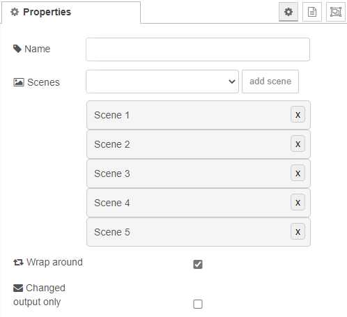

# Scene selector

A scene selector can be used to select scenes in a defined order. When the selector receives a message with a given ```msg.command``` property, it will select the corresponding scene and trigger its' activation. For more information on scenes see [scene-in](scene-in.md).

## Input

You can choose among the following commands:
- ```next``` activates the next scene
- ```previous``` activates the previous scene
- ```set``` directly activate a given scene. To specifiy which scene, a ```msg.scene``` property has to be set. It can either contain an integer corresponding to the array index of the scene or can contain a string corresponding to the "Scene" property of the [scene-in](scene-in.md) node.

## Configuration



### Scenes

Using the dropdown and the "add scene" button, you can generate a sequence of scenes. A scene can be removed by pressing the "X" button.

### Wrap around

This property decides, which behaviour the selector has, whenever the selected scene index reaches the beginning (when stepping down) or the end (when stepping up) of the scene sequence.
- If ```true```:
  | Command  | Current scene | New scene |
  |----------|---------------|-----------|
  | previous | first         | last      |
  | next     | last          | first     |
- If ```false```:
  | Command  | Current scene | New scene |
  |----------|---------------|-----------|
  | previous | first         | first     |
  | next     | last          | last      |

### Changed output only

If set to true, the node only outputs a scene selection if the selected scene has changed. If e.g. a ```set``` command with the same index is sent multiple time consecutively, the scene will be only triggered once.

## Example

See [example flow](../../examples/scene_example.flow).


[*← back to the index*](../documentation.md)